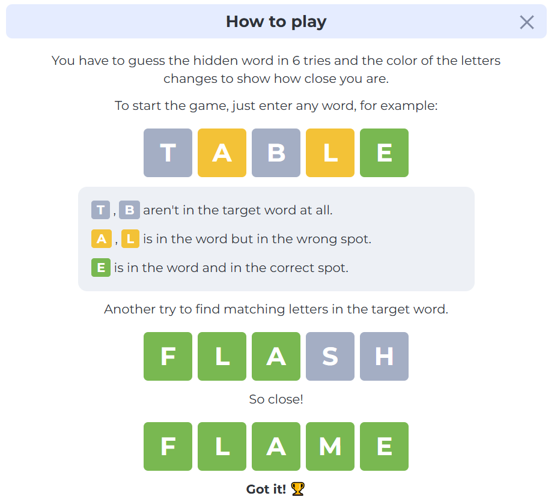
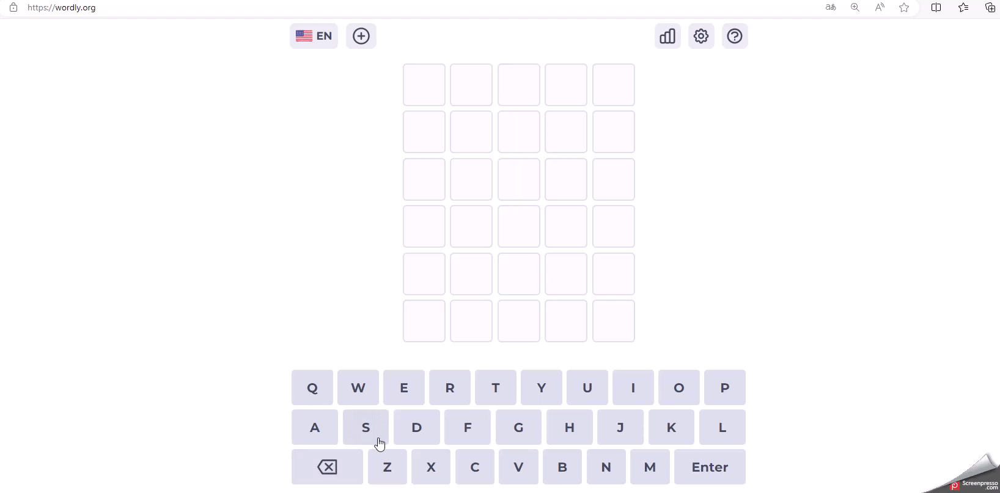
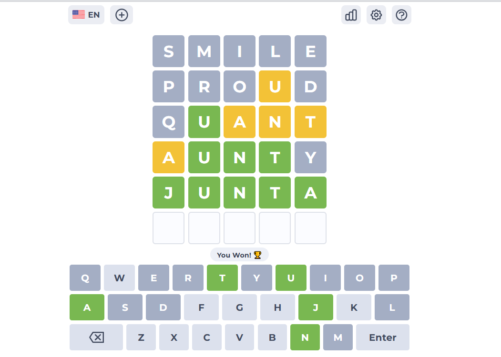

# Things You Need To Know About Entropy

**Author: Jiaqi Ye**

## Intro

本文将从一个游戏为例出发，介绍 **信息量(Information)** 的引入以及 **熵(Entropy)** 的概念，并在此基础上介绍与之相关的性质；随后拓展其定义到 **交叉熵(Cross Entropy)** 及其性质，包括了它为什么能够在机器学习领域内被广泛使用的直觉、动机和原因推导；最后将简单介绍 **KL散度(Kullback-Leibler Information Measure)** 和应用，并简单延申一些信息论中其他的概念与性质。

### Background

我们从2022年突然火起来的一个游戏 **[wordle](https://wordly.org/)** 开始介绍：这是一个猜词游戏，你需要在6次机会中猜中这个长度为5个字母的单词，在每次猜测之后，你会收到一个关于这个猜测的反馈，来提醒你这次猜测距离真实答案词还有多远，反馈体现在这次猜测每个字母所在格子的颜色当中-- 绿色  格子表示这个猜测的字母存在于答案词中并且**位置正确**， 黄色 格子表示这个猜测的字母存在于答案词中但是当前猜测的**位置不对**，灰色 则表示这个猜测的**字母不存在于答案词中**。为了方便表述，我们讲这样五个由字母、颜色块及其位置组成的”颜色组“称为**模式 (pattern)** 。

游戏的目标是，在尽可能少的猜测次数中，根据反馈的信息来找到答案词。
这里使用一个例子来解释猜测过程：

- 第一个猜测选择SMILE这个单词，第一个猜测的反馈是一个绿色格子和四个灰色格子，这个猜测看起来不错，帮助我将目标范围缩小到 “以S开头，且没有M,I,L,E这几个字母的，长度为5的单词”的pattern，基于这样的反馈，我会 **希望下一次猜测能够带来更多新的信息来帮助我进一步缩小范围** ，尽可能精准的定位到答案词。
- 抱着“下一次猜测带给我更多信息”的目标，第二次猜测我希望用一些没有尝试过的字母来组成猜测，这样会 **给我带来更多关于答案词的信息，答案词包括或者不包括哪些字母，以及他们的位置可能在哪里。** 所以，第二次猜测并没有选择以S开头的单词（此时这是一个已知信息，再次这样猜测会造成信息冗余，浪费我的猜测机会），选择PROUD这个单词。反馈的结果看起来也不错，说明答案词包括U,D这两个字母，并且他们的位置不在最后，答案词也不包括P,R,O这三个字母。
- 类似地，第三次猜测QUANT，但是从得到的反馈来说这似乎并不是一个太好的猜测：只多了一个新的字母T和字母U的位置信息，感觉上似乎并没有 **在第二次猜测的基础上帮我们缩减很多范围，以减少更多的不确定性**。
- 最后综合以上所有猜测带来的信息，答案词里字母U可能会在第三个位置或者结尾，以S开头，包括两个辅音字母T和D，脑海中STUDY这个词是符合条件的，那么尝试一下吧：很幸运的是第四次猜测正确，答案词正是STUDY，游戏结束。

每个人在玩这个游戏的时候都会有不同的选词偏好来开始第一次猜测，即便是在同一情形下也会因为不同的考量而给出完全不同的猜测来获取他们期望得到的信息。那么问题来了，**能否将一次猜测量化成一个分数值，从而评判这次猜测的质量**？

具体一点，我喜欢用SMILE这个单词作为开头，因为这个词包括了使用频率较高的字母E，如果反馈结果说答案词不包括E，那么我这个猜测就能够很大程度地缩小我下一步猜测的范围；我的另一个朋友则并不这么认为，他觉得词库里以S开头的长度为5的单词很多，并且含有I和E这样很常用的元音字母并不是一个能够有效缩减范围的好选择，相反，他很喜欢用WEARY (adj. 疲惫的；使人疲劳的；使人厌烦的；) 来作为他开头第一次猜测，他喜欢使用不常见的W原因是“他很享受 先赌一把，万一中头彩撞上了字母W”的感觉，也就是说如果他的猜测得到了第一个格子是绿色的某种颜色组（比如绿 灰 黄 灰 灰），那么在庞大的词库中只有58个单词符合这样的模式（答案词以W开头，包括字母A，不包括字母E,R,Y），这是一个**巨大的范围缩减**，这样来看，似乎他的猜测**质量更高一些这次猜测的得分就更高，因为这样能够更加方便他确定答案词**。

再比如这里，同样的猜测（第一次猜SMILE, 第二次猜PROUD, 第三次猜QUANT ）面对不同的题目和不同的反馈时，也会带给我们不同的信息（第一次猜测SMILE的反馈全部都是灰色格子，这似乎并不是一个好的猜测），影响着我们的选择。也就是说，这个**猜测的得分还需要满足：独立的、互不影响其发生概率的两个猜测所带来的信息应该是累加的**。

### Ideas
根据上述我们对游戏的理解，现在我们需要做的是：设置一个打分机制，使得每一次猜测都能够得到一个分数，这个分数用来衡量这次猜测质量的好坏。

这样的打分应该满足怎样的一些性质：
- **剩余的可选项越少，得分越高。** 换句话讲，我们在玩这个游戏时是拥有一个包含全部可能$N$个答案大词库的，每次进行一次猜测尝试时，反馈给出的模式（颜色和字母）都能一定程度地缩减满足模式的剩余可选项，范围缩小的越小，这次猜测越对我有利，则这次猜测的得分越高。假设每个词都同等概率地能够作为最终答案，那么剩余可选项的个数$n$越少，此次猜测能够猜中的**概率$\frac{n}{N}$ 就越小，这个猜测的得分就越高**。这里也暗示了我们后面要讲的Shannon's Information Theory中的一个核心观点--**丰富的信息意味着状况罕见 (What it means to be informative is that it's unlikely)**  。例如，作为撒哈拉沙漠的气象站，告诉当地人明天是晴天，那么给这句话打分并不会高，因为沙漠里是晴天本就很常见，这样的事情发生概率很高；而告诉当地人明天会下雨，那么给这句话打分就会很高，因为沙漠里下雨是罕见的状况，发生概率较小。
- **独立选择所得分具有可加性。** 
